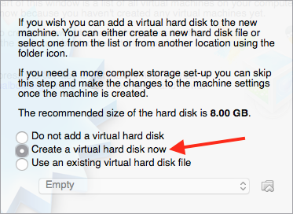
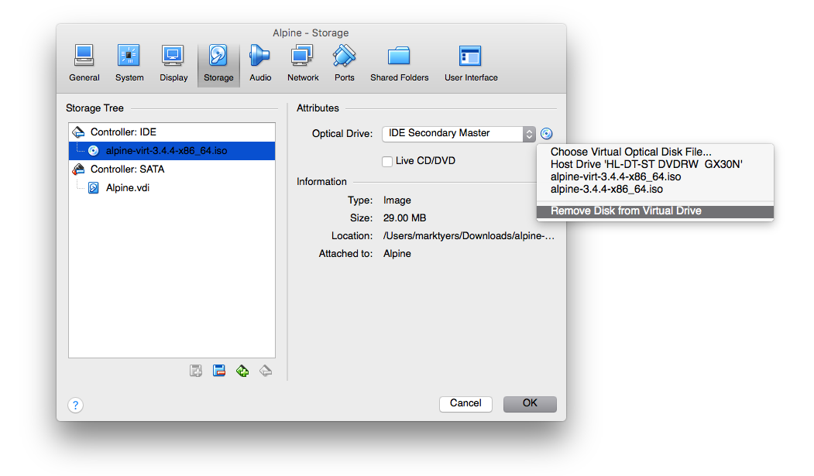
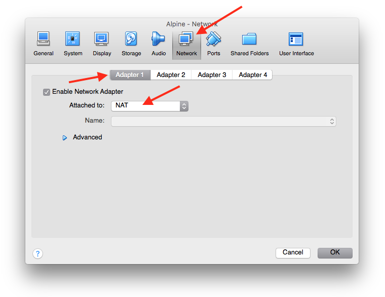
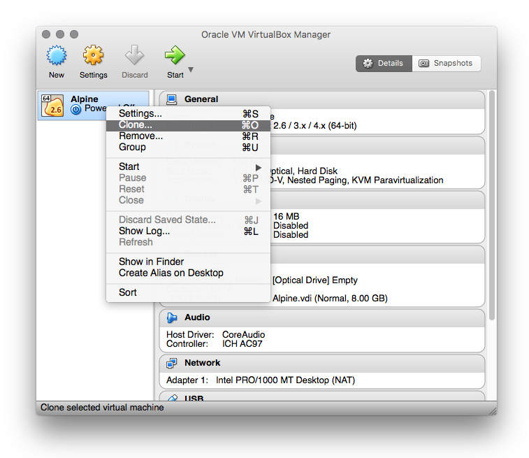

# Linux (Alpine)

This lab takes you through the process of creating a virtual network using Linux. By the end of the lab you will have a gateway server and a private server.

There is a video tutorial in two parts that covers this lab.
```
http://computing.coventry.ac.uk/~james/part1.flv
http://computing.coventry.ac.uk/~james/part2.flv
```

## Building a Gateway Server

In this task you will use the Alpine Linux image to build a gateway server which will have two network interfaces. The first (eth0) will be connected to the internal network whilst the other (eth1) will connect to the outside world. It will hand out IP addresses and other settings to the hosts on the internal network and will pass traffic from the internal network to the external one using Network Address Translation (NAT).

First, download the VirtualBox software, choose one that supports 64 bit systems. Next download the 64 bit version of (Alpine Linux)[https://www.alpinelinux.org/downloads/] that has a kernel optimised for virtual machines, the file was called `alpine-virt-3.4.4-x86_64.iso` at the time of writing, this is around 30MB.

Launch VirtualBox and click on the **New** button to create a new virtual machine.


On the next screen assign 512MB memory.


Now create a virtual hard disk. The type should be **VDI** and it should be dynamically allocated. 8GB should be sufficient. The disk will grow as needed so we will end up with a total image size of no more than 150MB.



Select the image and click on the **Settings** button. Select the **Storage** tab. Choose the empty IDE controller (with the CD icon) and click on the CD icon in the attributes section to select the .iso image you downloaded earlier.


Now the CD has been inserted we can close the settings screen and click on the **Start** button to boot the server from the installtion media. You will be presented with a login prompt, enter the username of `root` and press enter.
```
Welcome to Alpine Linux 3.4
Kernel 4.4.22-0-virtgrsec on an x86_64 (/dev/tty1)
localhost login: _
```
Once logged in you will need to go through the setup script using the `setup-alpine` command.
```
localhost:~# setup-alpine
```

1. Choose the `uk` keyboard.
2. The system hostname should be set to `gateway`
3. Choose to initialize the `eth0` interface (default option)
4. Set the address as `dhcp` (the default option)
5. You don't want to carry out any additional network configuration (`no`)
6. Now you will be prompted to change the root password.
7. Choose the `UTC` timezone
8. Choose `none` for proxies
9. Choose proxy number `13` (the UK based one)
10. Choose the default `openssh` option
11. Choose the default `chrony` as your NTP client

The next step is _really important_, we need to install the OS to `sda` which is the linux name for hard disk 1, its our virtual hard drive. We need to then choose the `sys` option. You will be prompted to erase the disk and continue, you need to choose `y`.

Linux is now installed and we need to shut the system down using the `poweroff` command so we can remove the CD and check the network settings.

Open the Settings again, choose the **Storage** tab and click on the CD in the Attributes section, selecting the _Remove Disk from Virtual Drive_ option. If you don't eject, the next time you power up the server it will boot from the CD instead of the hard drive!



### networking

Select the **Network** tab and make sure the first network adaptor is set to **NAT**. This means that all network traffic from the virtual machine will be handled by the _Host Computer_ (your laptop/desktop).



Now we can boot the server again by clicking on the **Start** button.

Once booted up you should log in as `root` using the password you specified. To check your connectivity try pinging the Google server.
```
ping google.com
```
There are some useful tools we should install.
```
apk add nano
```
Finally power down the server so we can clone it.

## Cloning the Server

Right-click the stopped server and choose the **Clone** option as shown.



Change its name to **Gateway** and make sure the box is checked to Reinitialise the MAC address otherwise all your servers will share the same one! Choose to make a **Linked Clone**, this takes up less space than a full clone.


The gateway server will need a second network card to communicate with the internal network. Select this cloned server and open the **Settings**. Select the **Network** tab and choose the **Adapter 2** tab. Enable the adapter and choose the **NAT** option. Linux will detect this interface as `eth1`.

Return to the first Interface and change it to **Internal**.


Boot up the Gateway server and log in. Network configuration is stored in the `/etc/network/interfaces` file so this needs to be loaded in the `nano` editor.
```
nano /etc/network/interfaces
```
The first network interface `eth0` is currently using DHCP to pick up an IP address but this will be changed for a static address. This means we need to replace `dhcp` with `static`.
```
auto lo
iface lo inet loopback

auto eth0
iface eth0 inet static
address 10.5.5.1
netmask 255.255.255.0
    hostname gatewayInternal

auto eth1
iface eth1 inet dhcp
    hostname gatewayOut
```
Save and exit `nano` then we restart the networking and check the interface settings.
```
/etc/init.d/networking restart
ifconfig
```
You will see that both network interfaces have IP addresses!

## DHCP Server

Now we will install the `dhcp server` and `iptables`.
```
apk add dhcp
apk add iptables
```
Create a simple configuration file in the current directory called `dhcpd.conf`. We use Google's DNS server `8.8.8.8`.
```
default-lease-time 600;
max-lease-time 7200;
authoritative;
log-facility local7;

subnet 10.5.5.0 netmask 255.255.255.0 {
  range 10.5.5.2 10.5.5.254;
  option domain-name-servers 8.8.8.8;
  option routers 10.5.5.1;
  option broadcast-address 10.5.5.255;
  default-lease-time 600;
  max-lease-time 7200;
}
```

Now we can set up the NAT IPTables rule. This allows traffic from the internal network to be sent out through our gateway. Create a file called `startGateway`.
```
# Allow traffic forwarding
sysctl -w net.ipv4.ip_forward=1

# Set up the IPTABLES rule
iptables -t nat -A POSTROUTING -o eth1 -j MASQUERADE
```
Now we can run it to make sure it works `sh startGateway`.

FInally we start the DHCP server. Before doing so we need an empty lease file.
```
touch /var/lib/dhcp/dhcpd.leases
dhcpd -4 -f -d -cf ./dhcpd.conf --no-pid eth0
```
We now have a functioning gateway server.

## Creating an Internal Server

To test it we need to make a new clone of our Alpine image. This one will only have internal networking. When it boots up we should see it ask the gateway for an IP address.

Clone the Alpine server and call it `Client`. Remember to reinitialise the MAC address and make it a Linked Clone.

Open the **Settings** and, in the **Network** tab configure Interface 1 as **Internal**. If we now boot up the server we can see it picks ip an IP address from the gateway server. If we check the route you will see it sends its requests through the gateway. Log into the client. We can check that the inteface has an IP address and that the requests get routed through the gateway server.
```
ifconfig
ip route show
```
Notice is passes traffic through `10.5.5.1` which is the internal interface of our gateway. Can we ping:

1. the gateway?
2. an IP address on the Internet?
3. an address that requires a DNS lookup?
```
ping 10.5.5.1
ping 8.8.8.8
ping bbc.co.uk
```

Congratulations. You now have a fully functional virtual network. You can download the completed exercise if you experienced any problems. You need to log into the servers using the `root` account with a password of `raspberry`.

```
http://computing.coventry.ac.uk/~mtyers/Servers.zip
```

### Configuring a Web Server

Open the network settings for the Gateway server and change Adapter 2 from **NAT** to **NAT Network**.

Create a new linked clone of the **Alpine** server (the master), call it **External**, don't forget to re-initialize the MAC address! Configure the first adapter as **NAT Network** and boot the server. This will be outside the private network and will be used to test our gateway.

Use `ifconfig` to make sure it has an IP address in this example it was `10.0.2.5`. Also make a record of the IP address of the gateway's external network interface `eth1`. in this case it was `10.0.2.4`. Try pinging the _gateway_ from the new _external_ server, this shound work.

### Installing the Web Server

We will set up the **Client** as a web server by installing and configuring **NGINX**.
```
apk add nginx
mkdir /data
mkdir /data/www
nano /data/www/index.html
```
Add a simple html web page and save.
```
<html>
  <head>
    <title>Hello World</title>
  </head>
  <body>
    <h1>Hello World</h1>
  </body>
</html>
```
Now edit the configuration file `/etc/nginx/nginx.conf` in nano. Delete the default one and create a new one.
```
rm /etc/nginx/nginx.conf
nano /etc/nginx/nginx.conf
```
Create a simple configuration.
```
events {

}

http {
    server {
        location / {
            root /data/www;
        }
    }
}
```
Now start nginx and reload the configuration with `nginx -s reload`.
```
mkdir /run/nginx
sudo service nginx start
nginx -s reload
```
As a simple test install `curl` on your gateway and try connecting to the client's IP address (in this case it was `10.5.5.2`)
```
apk add curl
curl 10.5.5.2
  <html>
  <head>
  <title>Hello World</title>
  </head>
  <body>
  <h1>Hello World</h1
  </body>
  </html>
```

Congratulations, you now have a functioning web server running on the client! The **External** server is not on the internal network so can only see the gateway server. Install `curl` and try connecting to the gateway.
```
curl 10.0.2.4
  curl: (7) Failed to connect to 10.0.2.4 port 80: Connection refused.
```
In the next section we will configure the gateway to pass all requests to the gateway server on port 80 to our web server running on the internal network.

## Configuring the Firewall

Now we have a simple network we can learn about how to configure a firewall. iptables is a command-line firewall utility that uses policy chains to allow or block traffic. When a connection tries to establish itself on your system, iptables looks for a rule in its list to match it to. If it doesn’t find one, it resorts to the default action. Earler we installed the `iptables` tools.

### Port Forwarding

Port forwarding uses network address translation to redirect a request from one address and port to a different address and port. This is needed to allow servers sitting on a private network to be accessible from outside this network. By default port forwarding is switched off. To enable it you need to create a config file and simply store `1` in it.

`echo 1 > /proc/sys/net/ipv4/ip_forward`

Job done.

### Setting up the Firewall

Now we will use the `iptables` command to configure the firewall. Start by listing the current rules using `iptables -L`.
```
iptables -L
  Chain INPUT (policy accept)
  target     prot opt source      destination
  Chain FORWARD (policy accept)
  target     prot opt source      destination
  Chain OUTPUT (policy accept)
  target     prot opt source      destination
```

There are three types of chain:

1. `INPUT` - used to control the behavour of _incoming_ connections
2. `FORWARD` - used to control incoming connections that need to be _passed on_ to other servers
3. `OUTPUT` - used to control the behaviour of _outgoing_ connections.

As you can see, there are currently no rules in place.

### Policies

There are behaviours that modify the default behaviour for each of the three types of chain. The default is `accept` which means the system accepts connections be default. The three options are:

1. `accept` - allow connections unless specified (blacklisting)
2. `drop` - drop the connection without notifying the client (whitelisting)
3. `reject` - drop the connection and return an error (whitelisting)

### Setting up the IPTables

We create a forward chain rule which _accepts port 80 connections on the public interface_ `eth1` and passes them to the private interface `eth0`. This first rule allows the first packet of a connection request:

`iptables -A FORWARD -i eth1 -o eth0 -p tcp --syn --dport 80 -m conntrack --ctstate NEW -j ACCEPT`

Next we allow subsequent packet exchanges subsequent to the initial connection request:

`iptables -A FORWARD -i eth1 -o eth0 -m conntrack --ctstate ESTABLISHED,RELATED -j ACCEPT`

and:

`iptables -A FORWARD -i eth0 -o eth1 -m conntrack --ctstate ESTABLISHED,RELATED -j ACCEPT`

Now we have to set-up the routing rules for NAT so that the port 80 requests are mapped to our **Client** private VM which is configured as a web server (substitute the IP address for `10.5.5.2` below):

`iptables -t nat -A PREROUTING -i eth1 -p tcp --dport 80 -j DNAT --to-destination 10.5.5.2`

The return communication from the private VM/web server needs to be pointed back to the gateway internal address as the inward communication packets currently have a return address outside of our local network (substitute your gateway internal address for 192.168.56.103 in the following):

`iptables -t nat -A POSTROUTING -o eth0 -p tcp --dport 80 -d 10.5.5.2 -j SNAT --to-source 10.5.5.1`

If you try to `curl` the gateway IP your request will be routed to the client web server and the html document will be routed back.
```
curl 10.0.2.4
  <html>
  <head>
  <title>Hello World</title>
  </head>
  <body>
  <h1>Hello World</h1
  </body>
  </html>
```

Additionally you will want to allow for outbound browsing from the network so add these rules too:

```
iptables -A OUTPUT -o eth0 -p tcp --dport 80 -m state --state NEW,ESTABLISHED -j ACCEPT
iptables -A INPUT -i eth0 -p tcp --sport 80 -m state --state ESTABLISHED -j ACCEPT
iptables -A OUTPUT -o eth0 -p tcp --dport 443 -m state --state NEW,ESTABLISHED -j ACCEPT
iptables -A INPUT -i eth0 -p tcp --sport 443 -m state --state ESTABLISHED -j ACCEPT
```
Finally you can list all the IPTables with `iptables -L` (note not showing the outbound browsing entries).
```
iptables -L
  Chain INPUT (policy accept)
    target     prot opt source      destination
  
  Chain FORWARD (policy accept)
    target     prot opt source      destination
    ACCEPT     tcp  --  anywhere    anywhere       tcp dpt:http flags:FIN,SYN,RST,ACK/SYN ctstate NEW
    ACCEPT     all  --  anywhere    anywhere       ctstate RELATED,ESTABLISHED
    ACCEPT     all  --  anywhere    anywhere       ctstate RELATED,ESTABLISHED
  Chain OUTPUT (policy accept)
    target     prot opt source      destination
```

### Testing

To test these settings:

1. try to curl the gateway server IP from the External server
2. make sure you can reach the Internet from your Client server.

### Starting the IP Tables on Boot

At the moment, all these settings will be lost if the server is stopped or rebooted.

To load the configuration at boot you need to save it to disk and then set up IP Tables to start on reboot.
```
/etc/init.d/iptables save
   * Saving iptables state ...
rc-update add iptables
   * service iptables added to runlevel default
```

### Deleting Rules

Sometimes you will make a mistake adding a new rule. To delete a rule you should first list the rules with line numbers.
```
sudo iptables -L --line-numbers
  Chain INPUT (policy accept)
    num  target     prot opt source      destination
  
  Chain FORWARD (policy accept)
    num  target     prot opt source      destination
    1    ACCEPT     tcp  --  anywhere    anywhere       tcp dpt:http flags:FIN,SYN,RST,ACK/SYN ctstate NEW
    2    ACCEPT     all  --  anywhere    anywhere       ctstate RELATED,ESTABLISHED
    3    ACCEPT     all  --  anywhere    anywhere       ctstate RELATED,ESTABLISHED
  Chain OUTPUT (policy accept)
    num  target     prot opt source      destination
```
To delete a rule you need to note the **chain** and **line number**. For example to delete the third rule in the **FORWARD** chain.
```
iptables -D FORWARD 3
```
